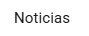

# Atomic Design Web Application Analysis Practice

## Description

The goal of this practice is to analyze a web application by identifying its components according to the principles of Atomic Design. For this practice, i'm going to analize the [EducamosCLM](https://educamosclm.castillalamancha.es/) webpage.

In this practice i'm going to identify the different atoms, molecules and organisms, ending with a template and the full frontpage of the web.

## Identifying Atomic Design Components:

### Atoms
An atom is a basic unit of information, a component of the lowest level. FOr clarity, every atom taken as an example will be displayed on the page Some of the main atoms displayed on the page are:

#### **Buttons:**

Every button in the page share the same shape but differ in their color and content. It's used all along the page

#### **Logos and official logos**

Used in the header and the footer. It justs represents the logo with an image. Here there are a couple of examples:

#### **Navbar items**

It only contains the text of an element in a navbar. There are navabars in the header and the footer. Here there is an example of each one

#### **Utility icon**

Icons that have some kind of functionality in the webpage's behaviour. This icons are distributed all over the page, from the header (search icon) to the card links or the carousel control arrows.

#### **Text atoms**

This atom type I've included different type of text units present in the webpage, from card titles to regular text contents and dates. They are also present all over the page.

#### **Links**

Links inside the page displayed in blue. In this case, they only appear on the cards near the bottom of the page and on the "Últimas noticias" section.

### Molecules

Molecules are groups of atoms with entity. Here are some of the most relevant:

#### **Navbar**

These are lists of navbar items used to navigate through different pages inside the main webpage. There are two present on the page: one on the header and another on the footer. 

#### **Carousel slide**

The carusel located on top of the page contains various slides. Each one would be a molecule.

### Organisms

### Template

### Page